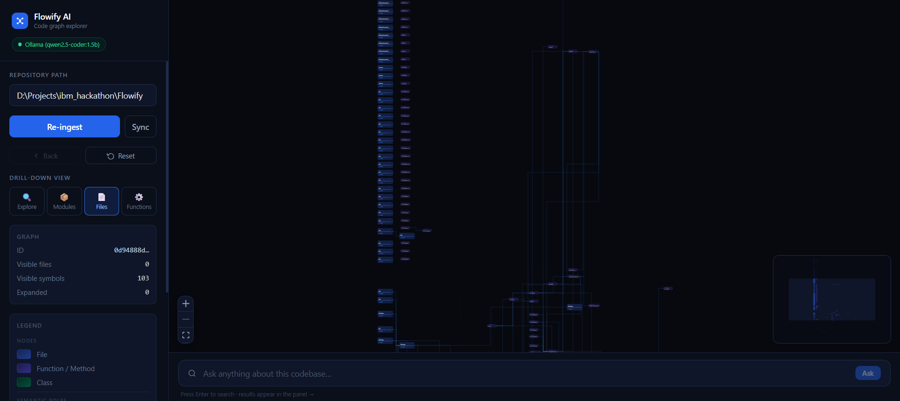
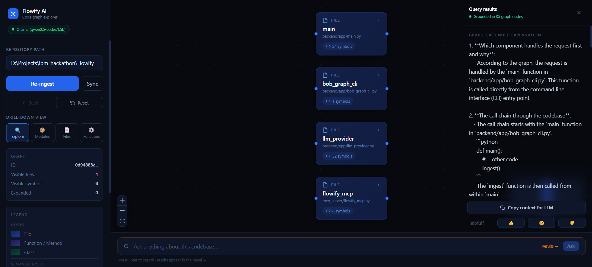

# Flowify AI

> **Interactive GraphRAG code explorer** — ingest any repository into a dual-layer call graph, navigate it visually, and answer natural-language questions grounded in the actual graph structure.

Flowify ingests a codebase through three phases (repo context → AST/semantic enrichment → continuous learning), renders it with ReactFlow + Dagre auto-layout, and lets you explore and query it through a dark-themed UI. The LLM backend is fully pluggable — Ollama (local, free) is recommended for development; IBM watsonx, Claude, OpenAI, and others are supported.

---

## Features

- **Interactive call graph** — dual-layer graph (function-level + module-level) with Dagre auto-layout. Drill down from module clusters → source files → individual functions/classes.
- **Per-node descriptions** — every node shows a one-line description of what that function/class/module does, derived from its docstring or code via AST analysis (or an LLM when one is configured).
- **Semantic edge types** — edges are colour-coded: blue = CALLS, green = EXPOSES_API, purple = USES_DB, yellow = EMITS_EVENT, red = CONSUMES_EVENT.
- **Change Impact analysis** — click any function to see its risk level (low/medium/high/critical), caller list, DB operations it touches, and affected modules.
- **Graph-grounded NLP queries** — ask questions in plain English; answers are anchored to real graph traversal with a "Grounded in N nodes" badge, numbered call-chain steps, and 👍/😐/👎 feedback.
- **Continuous learning** — query patterns and feedback adjust relevance scores and build a terminology map over time.

---

## Screenshots

### Graph exploration — drill-down from files to functions

After ingestion the graph loads instantly. The **Drill-down View** selector (Explore · Modules · Files · Functions) switches abstraction levels. Each node card shows the file/function name, path, symbol count, and a code-based one-line description.



### Natural-language queries with graph-grounded answers

Ask any question about the codebase. The answer is grounded in real graph traversal — every response shows which nodes were consulted, numbered execution steps, and a **Copy context for LLM** export button.



---

## Quick start

### One-command launch (recommended)

```bash
bash run.sh          # starts backend + frontend → http://localhost:5173
bash run.sh --test   # same, plus smoke-tests every API endpoint
```

### Manual

```bash
# Backend
cd backend
python -m venv .venv && source .venv/bin/activate   # Windows: .venv\Scripts\activate
pip install -r requirements.txt
python -m uvicorn app.main:app --host 127.0.0.1 --port 8000 --reload --reload-dir app

# Frontend (separate terminal)
cd frontend
npm install
npm run dev
```

Frontend → http://localhost:5173 · Backend → http://localhost:8000 · Swagger → http://localhost:8000/docs

---

## LLM providers

### Ollama — recommended for local development

Install [Ollama](https://ollama.com), pull a code model, start the server, and Flowify auto-detects it:

```bash
ollama pull qwen2.5-coder:1.5b   # ~1 GB, fast on CPU
# or larger models:
# ollama pull codellama           # 4 GB
# ollama pull deepseek-coder      # 7 GB

# Ollama starts automatically after install, or run manually:
ollama serve
```

Flowify tries models in this priority order (picks the first installed):
`codellama → deepseek-coder → qwen2.5-coder → llama3.x → mistral → phi3 → gemma2`

Override with env vars:
```bash
OLLAMA_HOST=http://localhost:11434   # default
OLLAMA_MODEL=codellama               # force a specific model
```

### All providers

| `LLM_PROVIDER` value | Provider | Required env var(s) |
|---|---|---|
| *(unset)* | **Auto-detect** — Ollama first, then cloud keys | — |
| `ollama` | Ollama (local) | *(none — just needs `ollama serve`)* |
| `bob` | IBM watsonx / Bob | `BOB_API_KEY`, `BOB_API_URL` |
| `claude` | Anthropic Claude | `ANTHROPIC_API_KEY` |
| `openai` | OpenAI | `OPENAI_API_KEY` |
| `copilot` | GitHub Copilot | `GITHUB_TOKEN` |
| `openclaw` | OpenClaw | `OPENCLAW_API_KEY`, `OPENCLAW_API_URL` |
| `heuristic` | No LLM — stubs only (fast, offline) | *(none)* |

### LLM cache

All provider responses are cached to `_store/llm_cache/` keyed by SHA256 of the prompt. The first ingestion of a large repo may take minutes (Ollama makes one call per function); subsequent runs are instant. Delete cache files manually to force re-summarisation.

---

## Environment variables

| Variable | Default | Purpose |
|---|---|---|
| `LLM_PROVIDER` | *(auto-detect)* | Provider selection (see table above) |
| `OLLAMA_HOST` | `http://localhost:11434` | Ollama server URL |
| `OLLAMA_MODEL` | *(auto-pick best installed)* | Force a specific Ollama model |
| `BOB_API_KEY` | *(unset)* | IBM Bob / watsonx API key |
| `BOB_API_URL` | IBM endpoint | IBM Bob API URL |
| `ANTHROPIC_API_KEY` | *(unset)* | Anthropic Claude API key |
| `ANTHROPIC_MODEL` | `claude-3-5-haiku-20241022` | Claude model |
| `OPENAI_API_KEY` | *(unset)* | OpenAI API key |
| `OPENAI_MODEL` | `gpt-4o-mini` | OpenAI model |
| `GITHUB_TOKEN` | *(unset)* | GitHub token for Copilot |
| `OPENCLAW_API_KEY` | *(unset)* | OpenClaw API key |
| `OPENCLAW_API_URL` | *(unset)* | OpenClaw endpoint |
| `FLOWIFY_STORE` | `./_store` | Graph + cache storage directory |

---

## Architecture

Flowify runs in three phases:

```
repo_path
  → ingestion.py          (language detection, file walk)
  → graph_builder.py      (AST → CIR nodes/edges, multi-language)
  → llm_provider.py       (summarize_function, analyze_semantics)
  → module_abstractor.py  (community detection → module nodes)
  → storage.py            (_store/{graph_id}.json)
  → retrieval.py          (query → graph BFS traversal)
  → learning.py           (feedback loop, terminology map)
```

**Phase 1 — Repo context** (`llm_ingestion.py`): analyses README, manifests, directory tree; detects project type, tech stack, entry points, architecture pattern.

**Phase 2 — Semantic enrichment** (`graph_builder.py` + `llm_provider.py`): multi-language AST parsing (Python, JS/TS, Java, C/C++) → Canonical Intermediate Representation (CIR) → per-function LLM summaries (intent, complexity, criticality). Module clustering via greedy modularity community detection (NetworkX).

**Phase 3 — Continuous learning** (`learning.py`): tracks query patterns and feedback; adjusts relevance scores; builds a terminology map.

### Semantic edge types

| Edge | Colour | Meaning |
|---|---|---|
| `CALLS` | Blue | Direct function call |
| `EXPOSES_API` | Green | HTTP / RPC endpoint |
| `USES_DB` | Purple | Database read/write |
| `EMITS_EVENT` | Yellow | Event / message publish |
| `CONSUMES_EVENT` | Red | Event / message subscribe |

### Graph storage

- Graphs: `_store/{graph_id}.json` — `{graph_id}` is a 12-char hex from `uuid4().hex[:12]`
- MCP repo IDs: 12-char hex from SHA256 of `repo_path` — **different from graph IDs**
- Override store location with `FLOWIFY_STORE` env var

---

## API reference

### UI-facing endpoints

| Method | Path | Body / Params | Returns |
|---|---|---|---|
| `POST` | `/ingest_repo` | `{repo_path}` | `{graph_id, function_count, module_count}` |
| `GET` | `/entry_points` | `?graph_id=&max_count=4` | Root file nodes for the initial view |
| `GET` | `/expand` | `?graph_id=&node_id=&action=callees\|functions` | `{children, edges}` |
| `GET` | `/graph` | `?graph_id=&depth=1..3` | Full graph at the requested depth |
| `GET` | `/impact` | `?graph_id=&node_id=` | Change impact analysis for a function |
| `POST` | `/query` | `{graph_id, query}` | `{explanation, execution_steps, graph_nodes_consulted}` |
| `POST` | `/feedback` | `{graph_id, query_id, rating}` | Feedback (feeds continuous learning) |
| `POST` | `/update` | `{graph_id}` | Re-ingests changed files via git diff |
| `GET` | `/provider_info` | — | Active LLM provider name + model |

### Analysis endpoints

| Method | Path | Returns |
|---|---|---|
| `GET` | `/repo_context?graph_id=` | Phase 1 repository analysis |
| `GET` | `/semantic_analysis?graph_id=` | Per-function semantic metadata |
| `GET` | `/analytics?graph_id=` | Query usage statistics |
| `GET` | `/hot_nodes?graph_id=&limit=10` | Most-queried functions |
| `GET` | `/module_details?graph_id=&module_id=` | Module with control-flow groups |

### MCP endpoints (for LLM assistants)

| Method | Path | Notes |
|---|---|---|
| `POST` | `/mcp/ingest` | Idempotent; returns stable `repo_id` from SHA256 of path |
| `POST` | `/mcp/query` | Structured function list + execution path |
| `POST` | `/bob/graph` | Full Bob-ready graph payload (CLI / agent use) |

---

## MCP server (VS Code integration)

```powershell
cd mcp_server
.\setup.ps1        # registers the MCP server into VS Code
# restart VS Code, then ask your AI assistant: "What tools do you have available?"
```

Bob CLI (from `backend/`):

```bash
python -m app.bob_graph_cli --repo-path /path/to/repo --depth 3
```

See [`mcp_server/README.md`](mcp_server/README.md) for full setup details.

---

## Running tests

```bash
# Run from project root (NOT from tests/ — relative imports will break)
pytest tests/ -v

# Individual suites
pytest tests/test_mcp_endpoints.py -v       # no server needed
pytest tests/test_integration.py -v         # requires FastAPI on :8000
pytest tests/test_self_graph.py -v          # ingests this repo itself
```

---

## Windows notes

- **B:\ drive error dialog**: `uvicorn --reload` uses watchfiles which enumerates all drive letters on Windows. Scope it to the app directory to prevent the error:
  ```bash
  python -m uvicorn app.main:app --host 127.0.0.1 --port 8000 --reload --reload-dir app
  ```
  `run.sh` and `start_server.ps1` already include this flag.

- **Long first-ingestion time**: Ollama makes one LLM call per function during ingestion. A 600-function repo can take 10–20 minutes on first run. All responses are cached — subsequent runs are instant. Use `LLM_PROVIDER=heuristic` for a no-LLM fast ingest.
