# Flowify — Self-Graph Reference

> What Flowify's graph should look like when ingesting its **own** codebase.  
> File nodes are the top level; functions inside are CONTAINS children; arrows are CALLS edges.

---

## Full architecture flowchart

```mermaid
flowchart LR

%% ─── STYLES ─────────────────────────────────────────────────────────────────
classDef file     fill:#0f2040,stroke:#3b82f6,color:#93c5fd,font-weight:bold
classDef fn       fill:#0f0a30,stroke:#6366f1,color:#a5b4fc
classDef cls      fill:#052014,stroke:#10b981,color:#6ee7b7
classDef endpoint fill:#1a0a00,stroke:#f59e0b,color:#fcd34d
classDef store    fill:#1a0020,stroke:#a855f7,color:#d8b4fe
classDef mcp      fill:#001a1a,stroke:#06b6d4,color:#67e8f9
classDef ext      fill:#111,stroke:#374151,color:#6b7280,stroke-dasharray:4 4

%% ══════════════════════════════════════════════════════════════════════════════
%% BACKEND
%% ══════════════════════════════════════════════════════════════════════════════

subgraph BE["🖥️  Backend  (backend/app/)"]
  direction TB

  %% ── main.py ──────────────────────────────────────────────────────────────
  subgraph MAIN["📄 main.py — FastAPI app"]
    direction TB
    EP_ingest["POST /ingest_repo"]:::endpoint
    EP_expand["GET  /expand"]:::endpoint
    EP_entry["GET  /entry_points"]:::endpoint
    EP_query["POST /query"]:::endpoint
    EP_update["POST /update"]:::endpoint
    EP_feedback["POST /feedback"]:::endpoint
    EP_provider["GET  /provider_info"]:::endpoint
    EP_mcpIngest["POST /mcp/ingest"]:::endpoint
    EP_mcpQuery["POST /mcp/query"]:::endpoint
    fn_genId["_generate_repo_id()"]:::fn
    fn_serial["_serialize_payload()"]:::fn
  end

  %% ── pipeline.py ─────────────────────────────────────────────────────────
  subgraph PIPE["📄 pipeline.py — Ingest orchestrator"]
    pip_ingest["ingest()"]:::fn
    pip_update["update()"]:::fn
    pip_summarize["_summarize_functions()"]:::fn
    pip_semantic["_analyze_semantics()"]:::fn
  end

  %% ── graph_builder.py ─────────────────────────────────────────────────────
  subgraph GB["📄 graph_builder.py — AST parser"]
    gb_build["build_function_graph()"]:::fn
    gb_parse["parse_file()"]:::fn
    gb_py["parse_python_file()"]:::fn
    gb_js["parse_js_ts_file()"]:::fn
    gb_java["parse_java_file()"]:::fn
    gb_c["parse_c_family_file()"]:::fn
    gb_visitor["_Visitor (AST walk)"]:::cls
    gb_calls["_append_call_edges()"]:::fn
  end

  %% ── module_abstractor.py ─────────────────────────────────────────────────
  subgraph MA["📄 module_abstractor.py — Graph abstraction layer"]
    ma_buildMods["build_modules()"]:::fn
    ma_findEntry["find_entry_files()"]:::fn
    ma_expandFile["expand_file_node()"]:::fn
    ma_expandNode["expand_node()"]:::fn
    ma_collapse["collapse_for_depth()"]:::fn
    ma_cluster["_cluster()"]:::fn
    ma_entryNode["_entry_node()"]:::fn
    ma_isTest["_is_test_file()"]:::fn
    ma_emitSymbols["_emit_symbol_children()"]:::fn
  end

  %% ── retrieval.py ─────────────────────────────────────────────────────────
  subgraph RET["📄 retrieval.py — Query & BFS"]
    ret_retrieve["retrieve_subgraph()"]:::fn
    ret_explain["explain()"]:::fn
    ret_entryNodes["_entry_nodes()"]:::fn
    ret_fromPayload["_graph_from_payload()"]:::fn
  end

  %% ── llm_provider.py ──────────────────────────────────────────────────────
  subgraph LLM["📄 llm_provider.py — LLM abstraction"]
    llm_getProvider["get_provider()"]:::fn
    llm_base["LLMProvider (ABC)"]:::cls
    llm_heuristic["HeuristicProvider"]:::cls
    llm_bob["BobProvider"]:::cls
    llm_anthropic["AnthropicProvider"]:::cls
    llm_openai["OpenAIProvider"]:::cls
    llm_copilot["CopilotProvider"]:::cls
    llm_ask["ask()"]:::fn
    llm_askJson["ask_json()"]:::fn
    llm_summarizeFn["summarize_function()"]:::fn
    llm_summarizeMod["summarize_module()"]:::fn
    llm_explainFlow["explain_flow()"]:::fn
    llm_interpretQ["interpret_query()"]:::fn
    llm_analyzeRepo["analyze_repository()"]:::fn
    llm_discover["_discover_entry_points()"]:::fn
    llm_scoreEntry["_score_entry_file()"]:::fn
    llm_heurRepo["_heuristic_repo_analysis()"]:::fn
  end

  %% ── llm_ingestion.py ─────────────────────────────────────────────────────
  subgraph LLMI["📄 llm_ingestion.py — LLM ingestion pass"]
    llmi_ingest["ingest_ast_results()"]:::fn
    llmi_buildPrompt["build_prompt()"]:::fn
    llmi_astNodes["_ast_nodes_payload()"]:::fn
    llmi_ground["_ground_truth_modules()"]:::fn
    llmi_fallback["_fallback_result()"]:::fn
  end

  %% ── storage.py ───────────────────────────────────────────────────────────
  subgraph STG["📄 storage.py — JSON persistence"]
    stg_save["save()"]:::fn
    stg_load["load()"]:::fn
    stg_list["list_graphs()"]:::fn
    stg_meta["store_meta() / load_meta()"]:::fn
    stg_newId["new_graph_id()"]:::fn
  end

  %% ── learning.py ──────────────────────────────────────────────────────────
  subgraph LEARN["📄 learning.py — Feedback & analytics"]
    learn_record["record_query()"]:::fn
    learn_feedback["record_feedback()"]:::fn
    learn_analytics["get_analytics()"]:::fn
    learn_hot["get_hot_nodes()"]:::fn
  end

  %% ── models.py (data shapes, no calls out) ────────────────────────────────
  subgraph MDL["📄 models.py — Pydantic models"]
    mdl_graph["GraphPayload"]:::cls
    mdl_fn["FunctionNode / FunctionEdge"]:::cls
    mdl_mod["ModuleNode / ModuleEdge"]:::cls
    mdl_req["IngestRequest / QueryRequest"]:::cls
    mdl_resp["QueryResponse / MCPIngestResponse"]:::cls
    mdl_fb["FeedbackRequest"]:::cls
  end

end

%% ══════════════════════════════════════════════════════════════════════════════
%% MCP SERVER
%% ══════════════════════════════════════════════════════════════════════════════

subgraph MCP_SRV["🔌 MCP Server  (mcp_server/)"]
  mcp_main["flowify_mcp.py"]:::mcp
  mcp_resilience["resilience.py"]:::mcp
  mcp_ingestTool["Tool: ingest_repo"]:::mcp
  mcp_queryTool["Tool: query_repo"]:::mcp
end

%% ══════════════════════════════════════════════════════════════════════════════
%% FRONTEND
%% ══════════════════════════════════════════════════════════════════════════════

subgraph FE["⚛️  Frontend  (frontend/src/)"]
  direction TB

  subgraph APP["📄 App.jsx — Root"]
    app_root["App()"]:::fn
  end

  subgraph STORE["📄 store.js — Zustand state"]
    st_ingest["ingest()"]:::store
    st_expand["toggleExpand()"]:::store
    st_query["runQuery()"]:::store
    st_loadInit["loadInitial()"]:::store
    st_goBack["goBack()"]:::store
    st_reset["resetView()"]:::store
    st_feedback["sendFeedback()"]:::store
    st_clearQuery["clearQuery()"]:::store
  end

  subgraph GV["📄 GraphView.jsx — React Flow canvas"]
    gv_inner["GraphViewInner()"]:::fn
    gv_dagre["dagreLayout()"]:::fn
    gv_fileNode["FileNodeComponent"]:::cls
    gv_fnNode["FunctionNodeComponent"]:::cls
    gv_empty["EmptyState"]:::fn
  end

  subgraph SB["📄 Sidebar.jsx"]
    sb_sidebar["Sidebar()"]:::fn
    sb_badge["ProviderBadge()"]:::fn
    sb_stat["Stat()"]:::fn
  end

  subgraph QP["📄 QueryPanel.jsx"]
    qp_panel["QueryPanel()"]:::fn
  end

  subgraph QR["📄 QueryResults.jsx"]
    qr_results["QueryResults()"]:::fn
    qr_copy["buildContext()"]:::fn
  end
end

%% ══════════════════════════════════════════════════════════════════════════════
%% EXTERNAL DEPENDENCIES (shown as dashed boxes)
%% ══════════════════════════════════════════════════════════════════════════════

nx["networkx DiGraph"]:::ext
ast_mod["Python ast module"]:::ext
dagre_lib["@dagrejs/dagre"]:::ext
rf_lib["React Flow"]:::ext
zustand["Zustand"]:::ext
llm_api["LLM APIs\n(OpenAI / Anthropic\n/ IBM watsonx)"]:::ext
fs_store["_store/ JSON files\n(disk)"]:::ext

%% ══════════════════════════════════════════════════════════════════════════════
%% CALLS EDGES — Backend
%% ══════════════════════════════════════════════════════════════════════════════

%% HTTP → pipeline / storage / module_abstractor
EP_ingest   -->|calls| pip_ingest
EP_ingest   -->|reads| stg_meta
EP_expand   -->|calls| ma_expandFile
EP_expand   -->|calls| ma_expandNode
EP_expand   -->|reads| stg_load
EP_entry    -->|calls| ma_findEntry
EP_entry    -->|reads| stg_load
EP_query    -->|calls| ret_retrieve
EP_query    -->|calls| ret_explain
EP_query    -->|reads| stg_load
EP_update   -->|calls| pip_update
EP_feedback -->|calls| learn_feedback
EP_mcpIngest -->|calls| pip_ingest
EP_mcpIngest -->|reads| stg_list
EP_mcpQuery  -->|calls| ret_retrieve
EP_mcpQuery  -->|calls| ret_explain

%% pipeline → dependents
pip_ingest  -->|calls| gb_build
pip_ingest  -->|calls| ma_buildMods
pip_ingest  -->|calls| stg_save
pip_ingest  -->|calls| stg_newId
pip_ingest  -->|calls| stg_storeMeta
pip_ingest  -->|calls| llmi_ingest
pip_update  -->|calls| stg_load
pip_update  -->|calls| gb_parse
pip_update  -->|calls| stg_save
pip_summarize -->|calls| llm_summarizeFn
pip_semantic  -->|calls| llm_ask

%% graph_builder internals
gb_build    -->|calls| gb_parse
gb_parse    -->|calls| gb_py
gb_parse    -->|calls| gb_js
gb_parse    -->|calls| gb_java
gb_parse    -->|calls| gb_c
gb_py       -->|uses| gb_visitor
gb_py       -->|calls| gb_calls
gb_build    -->|uses| nx

%% module_abstractor
ma_buildMods  -->|calls| ma_cluster
ma_buildMods  -->|calls| llm_summarizeMod
ma_findEntry  -->|calls| ma_entryNode
ma_findEntry  -->|calls| ma_isTest
ma_findEntry  -->|calls| llm_discover
ma_expandFile -->|calls| ma_emitSymbols
ma_expandNode -->|calls| ma_emitSymbols

%% retrieval
ret_retrieve  -->|calls| ret_fromPayload
ret_retrieve  -->|calls| ret_entryNodes
ret_retrieve  -->|calls| llm_interpretQ
ret_retrieve  -->|uses| nx
ret_explain   -->|calls| llm_explainFlow
ret_entryNodes -->|calls| learn_record

%% LLM provider
llm_getProvider -->|creates| llm_heuristic
llm_getProvider -->|creates| llm_bob
llm_getProvider -->|creates| llm_anthropic
llm_getProvider -->|creates| llm_openai
llm_getProvider -->|creates| llm_copilot
llm_heuristic  -->|calls| llm_heurRepo
llm_heuristic  -->|calls| llm_discover
llm_heurRepo   -->|calls| llm_scoreEntry
llm_bob        -->|calls| llm_api
llm_anthropic  -->|calls| llm_api
llm_openai     -->|calls| llm_api
llm_copilot    -.->|extends| llm_openai
llm_ask        -->|uses| llm_base
llm_summarizeFn -->|calls| llm_ask
llm_summarizeMod -->|calls| llm_askJson
llm_explainFlow  -->|calls| llm_ask
llm_interpretQ   -->|calls| llm_askJson
llm_analyzeRepo  -->|calls| llm_ask

%% LLM ingestion
llmi_ingest     -->|calls| llmi_buildPrompt
llmi_ingest     -->|calls| llmi_astNodes
llmi_ingest     -->|calls| llm_askJson
llmi_ingest     -->|calls| llmi_fallback
llmi_buildPrompt -->|calls| llmi_ground

%% storage ↔ disk
stg_save   -->|writes| fs_store
stg_load   -->|reads| fs_store
stg_list   -->|reads| fs_store
stg_meta   -->|reads| fs_store

%% ── storage helpers referenced inline ────────────────────────────────────
stg_storeMeta["store_meta()"]:::fn

%% MCP Server
mcp_main      -->|uses| mcp_resilience
mcp_ingestTool -->|HTTP POST| EP_mcpIngest
mcp_queryTool  -->|HTTP POST| EP_mcpQuery

%% ══════════════════════════════════════════════════════════════════════════════
%% CALLS EDGES — Frontend
%% ══════════════════════════════════════════════════════════════════════════════

app_root  -->|renders| gv_inner
app_root  -->|renders| sb_sidebar
app_root  -->|renders| qp_panel
app_root  -->|renders| qr_results

gv_inner  -->|reads| st_ingest
gv_inner  -->|calls| st_expand
gv_inner  -->|calls| gv_dagre
gv_inner  -->|uses| gv_fileNode
gv_inner  -->|uses| gv_fnNode
gv_dagre  -->|uses| dagre_lib
gv_inner  -->|uses| rf_lib

sb_sidebar -->|reads| zustand
sb_sidebar -->|calls| st_ingest
sb_sidebar -->|calls| st_goBack
sb_sidebar -->|calls| st_reset
sb_badge   -->|fetches| EP_provider

qp_panel  -->|calls| st_query
qr_results -->|reads| zustand
qr_results -->|calls| qr_copy
qr_results -->|calls| st_feedback
qr_results -->|calls| st_clearQuery

st_ingest    -->|POST /api/ingest_repo| EP_ingest
st_loadInit  -->|GET  /api/entry_points| EP_entry
st_expand    -->|GET  /api/expand| EP_expand
st_query     -->|POST /api/query| EP_query
st_feedback  -->|POST /api/feedback| EP_feedback
```



---

## Node taxonomy legend

| Shape / colour | What it represents |
|---|---|
| 🔵 Blue border | **File node** — top-level expandable entry |
| 🟣 Indigo border | **Function / method** — callable symbol |
| 🟢 Green border | **Class** — OOP type |
| 🟡 Amber border | **HTTP endpoint** — FastAPI route |
| 🟣 Purple border | **Zustand store action** |
| 🩵 Cyan border | **MCP server tool** |
| ⬜ Dashed grey | External library / disk |

---

## Entry points Flowify would detect for its own repo

| Priority | File | Reason |
|---|---|---|
| 1 | `backend/app/main.py` | `app = FastAPI()`, contains all HTTP routes |
| 2 | `mcp_server/flowify_mcp.py` | `Server("flowify")`, MCP entrypoint |
| 3 | `backend/app/pipeline.py` | `ingest()` / `update()` — core orchestrator |
| 4 | `backend/app/bob_graph_cli.py` | CLI entrypoint (argparse / `__main__`) |

---

## Key data-flow paths

### 1 · Ingest path
```
User (repo_path)
  → POST /ingest_repo
    → pipeline.ingest()
      ├── graph_builder.build_function_graph()   # AST → FunctionNode[], FunctionEdge[]
      │     └── parse_file() → _Visitor (walk AST) → _append_call_edges()
      ├── module_abstractor.build_modules()      # cluster fns → ModuleNode[]
      │     └── llm_provider.summarize_module()  # optional AI summaries
      ├── llm_ingestion.ingest_ast_results()     # build LLM prompt → AI response
      │     └── llm_provider.ask_json()
      └── storage.save()                         # persist GraphPayload to disk
```

### 2 · Query path
```
User (natural language query)
  → POST /query
    → retrieval.retrieve_subgraph()
      ├── llm_provider.interpret_query()    # AI picks candidate function names
      ├── _entry_nodes()                    # map names → graph IDs
      └── BFS over nx.DiGraph (CALLS edges, max_hops=2)
    → retrieval.explain()
      └── llm_provider.explain_flow()       # AI narrates the subgraph
  ← { explanation, path, subgraph }
```

### 3 · Expand path
```
User (click file node)
  → GET /expand?action=functions
    → module_abstractor.expand_file_node()
      └── _emit_symbol_children()           # FunctionNode[] for that file
  ← { children: FunctionNode[], edges: FunctionEdge[] }

User (click function node)
  → GET /expand?action=callees
    → module_abstractor.expand_node()
      └── _emit_symbol_children() on callee set
  ← { children: FunctionNode[], edges: FunctionEdge[] }
```

### 4 · Frontend render path
```
store.loadInitial()  →  GET /entry_points  →  4 FileNode cards
  ↓ user clicks a file card
store.toggleExpand() →  GET /expand?action=functions
  → rfNodes[] (FileNodeComponent / FunctionNodeComponent)
  → dagreLayout() (LR, ranksep=130) via @dagrejs/dagre
  → React Flow renders positioned nodes + edges
  ↓ user types query
store.runQuery()     →  POST /query
  → QueryResults slide-in panel shows explanation + relevant functions
```
